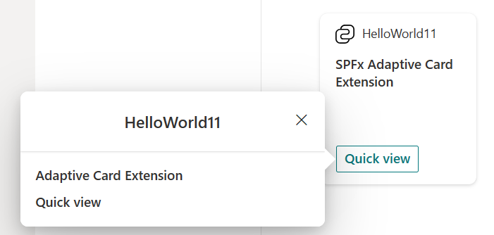

# Using the Workbench to test custom Adaptive Card Extensions (ACE)
In this exercise you will test that all the tools are installed and that they are working correctly.

## Task 1 - Create an Adaptive Card Extension project
1.	Create a folder for your project named AceBootcamp (e.g. C:\Code\Labs\AceBootcamp).
2.	In a terminal, change the working directory to AceBootcamp folder.
3.	Run the following command to start scaffolding a new solution.
        
        yo @microsoft/sharepoint

4.	Answer the generator's prompts:

    - **What is your solution name:**  ace-bootcamp
    - **Which type of client-side component to create:**   Adaptive Card Extension
    - **Which template do you want to use:**    Basic Card Template
    - **What is your Adaptive Card Extension name:**    AceBootcamp

5.	Wait for the project creation to complete. It may take a few minutes.

##Task 2 - Test the newly created Adaptive Card Extension
1. Change the working directory to your project folder
2. Run the following command to trust the cert used by the local dev server 
        
        gulp trust-dev-cert

3. Run the following command to start the local web server so that you can test the
        
        gulp serve --nobrowser

4. Open your SharePoint home site and append “/_layouts/workbench.aspx”
        
        https://your-tenantname.sharepoint.com/_layouts/workbench.aspx

5. Click the « + » button to add a WebPart

6. Select **AceBootcamp** card under **Local** group and it should look something like this:

7. Click on **Preview** button in the top right corner.
8. Click on the **Quick view** button on the ACE Card to open the quick view

## Common issues and resolutions
| Issue | Resolution | 
|-----------|-----------|
| Certificate error in network trace when loading ACE manifests from local machine | Run the command to [task 2](./#task-2---test-the-newly-created-adaptive-card-extension) trust dev certificate. If you have already done so, then try restarting you web browser. |
| Cannot find **gulp** in the terminal | Try restarting the terminal window |