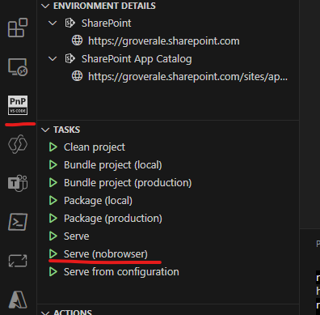
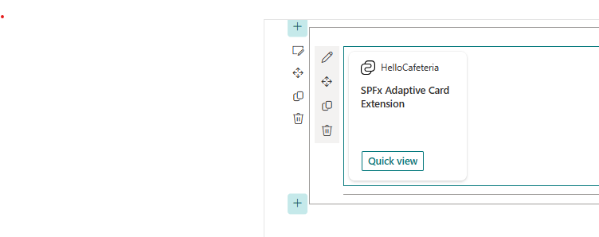

# Create the ACE Project
In this exercise we create the Cafeteria ACE that will be used in subsequent exercise in this bootcamp.

## Task 0 - Install Viva Connections Toolkit (if not installed already)

1. Navigate to the Viva Connections Toolkit [download link](https://marketplace.visualstudio.com/items?itemName=m365pnp.viva-connections-toolkit)
2. Click the **Install** button, this will open the extension in your VSCode app
3. Click **Install** again, wait for the extension to complete installion.
4. Log into your M365 dev / demo tenant.

## Task 1 - Create an Adaptive Card Extension project (using Viva Connections Toolkit)
1. Create a sub folder in your dev area p (e.g. C:\Code\Labs\CafteriaACE).
2. In a terminal, change the working directory to **CafeteriaACE** folder.
3. Run the following command to open VS Code.
        
        code .

4. This will open VSCode in your working directory. Launch the Viva Connections Toolkit Extension from the app rail and click **Create a new project**

5. Select the **CafeteriaACE** directory for your project.

6. Fill out the prompts

    - **What is your solution name:**  cafeteria-ace
    - **Which type of client-side component to create:**   Adaptive Card Extension
    - **Which template do you want to use:**    Basic Card Template
    - **What is your Adaptive Card Extension name:**    HelloCafeteria

7.	Wait for the project creation to complete. It may take a few minutes. Once complete, VSCode will open the project.

> **Note**
>
> Viva Connections Toolkit extension is using `yo @microsoft/sharepoint` under the covers

## Task 2 - Test the newly created Adaptive Card Extension

1. Use the extension tasks to launch the ACE. Click the `Serve (nobrowser)` task button
        

> **Note**
>
> This button is running `gulp serve --nobrowser` under the covers 

2. Open your SharePoint home site and append “/_layouts/workbench.aspx”
        
        https://your-tenantname.sharepoint.com/_layouts/workbench.aspx

3. Click the « + » button to add a WebPart

4. Select **HelloCafeteria** card under **Local** group and it should look something like this:

5. Click on **Preview** button in the top right corner.
6. Click on the **Quick view** button on the ACE Card to open the quick view

## Task 3 - Add an additional ACE to the project

1. Use the Extension Actions to add a new component to your solution. Click the `Add new component` button.

2. Fill out the prompts

    - **Which type of client-side component to create:**   Adaptive Card Extension
    - **Which template do you want to use:**    Primary Card Template
    - **What is your Adaptive Card Extension name:**    HelloCafeteriaBonus

3. Gulp may still be running, if not start it again. Navigate to your workbench and refresh the page. You should now have two ACEs in the **Local** group

4. Add the second ACE. You should now have two ACEs running on your workbench.

