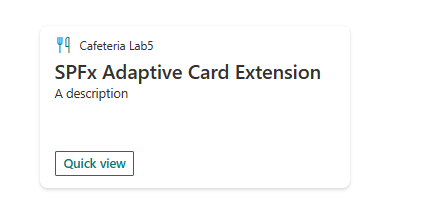
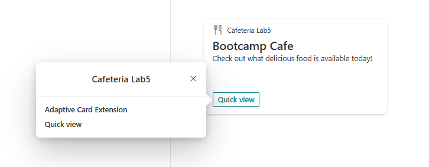

# Update Card View
In this exercise we will be modifying the ACE Card View. The card view is the first view that is loaded by the ACE. We will be following on from the cafeteria ACE created in Lab 3 and worked on in lab 4 so please complete these first. 

This Lab will also assume you have the knowledge gained from the previous labs. Please refer back if you get stuck.

## Task 1 - Change the CardView Base Type

You have learnt that there are three base CardView types. The Card View base type is chosen during project scaffolding but it is possible to change this without creating a new project.

1. Launch CardView.ts

To change the base type to `PrimaryTextCardView` we need to update a number of areas in the `CardView.ts`

2. Update the imports to include `BasePrimaryTextCardView` and `IPrimaryTextCardParameters`. Example as below:

```typescript
import {
  BasePrimaryTextCardView,
  IPrimaryTextCardParameters,
  IExternalLinkCardAction,
  IQuickViewCardAction,
  ICardButton
} from '@microsoft/sp-adaptive-card-extension-base';
```

3. Update the CardView's Class BaseClass Type to `BasePrimaryTextCardView` (line 11)

``` typescript
export class CardView extends BasePrimaryTextCardView<IHelloCafeteriaAdaptiveCardExtensionProps, IHelloCafeteriaAdaptiveCardExtensionState> {
    ...
}
```

4. Update the CardView `data()` methods return type to `IPrimaryTextCardParameters`. You will also need ot add a place holder description to ensure your ACE project will compile.
```typescript
public get data(): IPrimaryTextCardParameters {
    return {
        primaryText: strings.PrimaryText,
        description: "A description",
        title: this.properties.title
    };
}
```

5. Save you changes and check your workbench. Your CardView should look like the below (you may need to update the title)



Your CardView.ts should look at follows

```typescript
import {
  BasePrimaryTextCardView,
  IPrimaryTextCardParameters,
  IExternalLinkCardAction,
  IQuickViewCardAction,
  ICardButton
} from '@microsoft/sp-adaptive-card-extension-base';
import * as strings from 'HelloCafeteriaAdaptiveCardExtensionStrings';
import { IHelloCafeteriaAdaptiveCardExtensionProps, IHelloCafeteriaAdaptiveCardExtensionState, QUICK_VIEW_REGISTRY_ID } from '../HelloCafeteriaAdaptiveCardExtension';

export class CardView extends BasePrimaryTextCardView<IHelloCafeteriaAdaptiveCardExtensionProps, IHelloCafeteriaAdaptiveCardExtensionState> {
  public get cardButtons(): [ICardButton] | [ICardButton, ICardButton] | undefined {
    return [
      {
        title: strings.QuickViewButton,
        action: {
          type: 'QuickView',
          parameters: {
            view: QUICK_VIEW_REGISTRY_ID
          }
        }
      }
    ];
  }

  public get data(): IPrimaryTextCardParameters {
    return {
      primaryText: strings.PrimaryText,
      description: "A description",
      title: this.properties.title
    };
  }

  public get onCardSelection(): IQuickViewCardAction | IExternalLinkCardAction | undefined {
    return {
      type: 'ExternalLink',
      parameters: {
        target: 'https://www.bing.com'
      }
    };
  }
}
```

## Task 2 - Update the CardView

We are making a Cafeteria Menu card, let's update the card to reflect this.

1. Navigate back to your `CardView.ts`. To update the Card View text fields we need to update the `data()` method. We will update the `primaryText` and `description` values. Leave the `title` value for now.

```typescript
public get data(): IPrimaryTextCardParameters {
    return {
        primaryText: "Bootcamp Cafe",
        description: "Check out what delicious food is available today!",
        title: this.properties.title
    };
}
```

2. Whilst we are here, let's update the `onCardSelection()` action to open the QuickView rather than bing.com. To do this we need return value type to `QuickView` and adjust the parameters to reference the QuickView that we want to launch. Example below:

```typescript
public get onCardSelection(): IQuickViewCardAction | IExternalLinkCardAction | undefined {
    return {
      type: 'QuickView',
        parameters: {
          view: QUICK_VIEW_REGISTRY_ID
        }
    };
  }
```
3. Save you changes and check your workbench. Your CardView should look like the below. Check that the QuickView is launched when clicking on the cardview.



> **Remember**
>
> CardView Actions only fire when in preview mode
