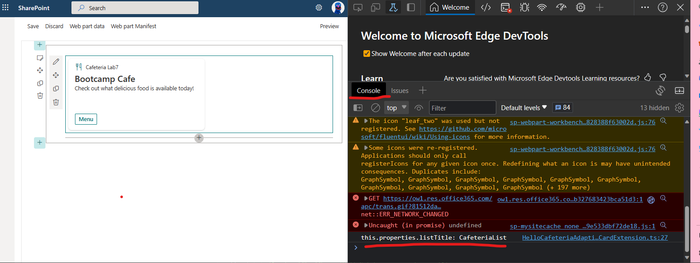
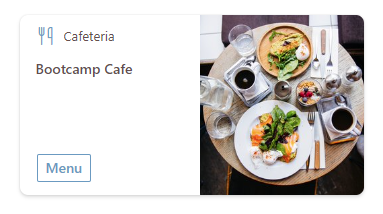

# Exercise 7 - Add Properties to your ACE
In this exercise we will add properties to the ACE which will make our ACE configurable. By configurable we mean settings / configuration that will define how the ACE will look or operate. 

We will be following on from the cafeteria ACE created in the previous Lab Session. If you completed Lab 6, please continue from there. 

If not, you can download the starter code under Session 3/Starter

Once you extract all the files, go to the root folder and run:

    npm install

## Task 1. Add a property to the ACE

We need to prepare the ACE to get data (spoiler Alerts for the next lab) from a SPO List. Add a property to your ace for the SharePoint List Title.

1. Go to the file CafeteriaMenuAdaptiveCardExtension.ts. Update the `ICafeteriaMenuAdaptiveCardExtensionProps` interface to include an additional string property called `listTitle`

```typescript
export interface ICafeteriaMenuAdaptiveCardExtensionProps {
  title: string;
  listTitle: string;
}
```

2. It's good practice to include a default values for all properties. Include a default value for this property in the manifest file.

```json
"properties": {
  "title": "Cafeteria",
  "listTitle": "CafeteriaList"
},
```

3. Go back to CafeteriaMenuAdaptiveCardExtension.ts. Add a `console.log()` to `onInit()` method to output the `listTitle` property value. This won't effect the CardView or QuickView. A user of the ACE will not see this, only the developer.

```typescript
public onInit(): Promise<void> {
    this.state = { };

    console.log(`this.properties.listTitle: ${this.properties.listTitle}`);
    ..
}
```

4. Save you changes and check your workbench. Your card should look no different. To see the console.log we will need to open developer tools in your browser `(Shift+Ctrl+I or F12)`. You should see the below in the console.



## Task 2. Use Properties in the CardView

We want to add a property that we can see the changes directly in the card. Let's add an imageURL property.

1. Update the `ICafeteriaMenuAdaptiveCardExtensionProps` interface again to include an additional string property called `imageURL`

```typescript
export interface ICafeteriaMenuAdaptiveCardExtensionProps {
  title: string;
  listTitle: string;
  imageUrl: string;
}
```

2. Again, it's good practice to include a default value for all properties. Add a default value for the `imageURL` property in the manifest file.

```json
"properties": {
  "title": "Cafeteria",
  "listTitle": "CafeteriaList",
  "imageUrl": "https://media.akamai.odsp.cdn.office.net/uksouth1-mediap.svc.ms/transform/thumbnail?provider=url&inputFormat=jpg&docid=https%3A%2F%2Fcdn.hubblecontent.osi.office.net%2Fm365content%2Fpublish%2Fb0e728ff-166f-4ab8-8a94-c89a1f27670b%2F1063044852.jpg&w=400"
},
```

> **Note**
>
> This .svg file is stored in an Azure Storage Account that allows anonymous access. Feel free to use another image if desired.


3. Now we want to include this in our CardView - Trouble being we need to change our CardView base type again. Launch CardView.ts

4. Update the imports to include `BaseImageCardView` and `IImageCardParameters`. Example as below:

```typescript
import {
  BaseImageCardView,
  IImageCardParameters,
  IExternalLinkCardAction,
  IQuickViewCardAction,
  ICardButton
} from '@microsoft/sp-adaptive-card-extension-base';
```

5. Update the CardView's Class BaseClass Type to `BaseImageCardView` (line 10)

``` typescript
export class CardView extends BaseImageCardView<ICafeteriaMenuAdaptiveCardExtensionProps, ICafeteriaMenuAdaptiveCardExtensionState> {
  ...
}
```

6. Update the CardView `data()` method's return type to `IImageCardParameters`. This is where we will add the reference to our new `imageUrl` property.
```typescript
public get data(): IImageCardParameters {
  return {
    primaryText: strings.PrimaryText,
    imageUrl: this.properties.imageUrl,
    title: this.properties.title
  };
}
```

> **Note**
>
> The differences in capitalization matters! (imageUrl vs imageURL)

7. Save your changes and check your workbench. Your CardView should look like the below screenshot. Pretty fancy!

