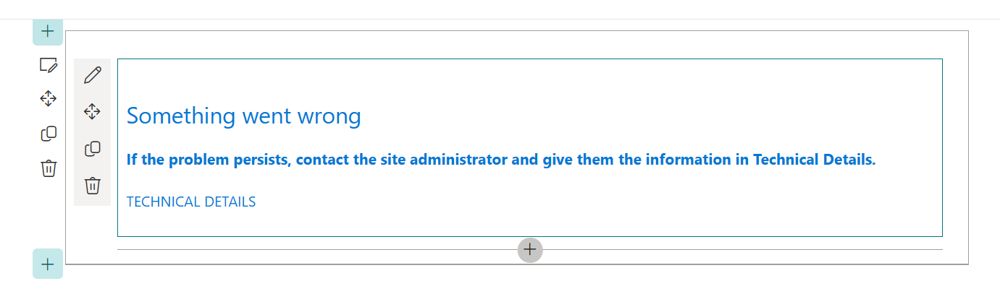

# Exercise 10 - Consume SPO data
In this exercise we will add functionality to the ACE to consume data from an SPO list.

We will be following on from the cafeteria ACE solution we prepared in the pervious Lab Sessions. 

## Task 1 - Populate the data source

We need to create a list that will work with the interface we have defined. To do this, we have prepared a `PowerShell` script that uses `PnP.PowerShell` to streamline the process.

1. Download the script from [here](https://dev.azure.com/CEandS/836eb273-0e36-48af-a1c0-a78790ff1bec/_apis/git/repositories/f8282c8f-7b8c-4f7f-962e-fa6118fb3ef7/items?path=/Labs/Session%205/CreateList.ps1). You will also need to download a copy of [`meals.json`](https://dev.azure.com/CEandS/836eb273-0e36-48af-a1c0-a78790ff1bec/_apis/git/repositories/f8282c8f-7b8c-4f7f-962e-fa6118fb3ef7/items?path=/Labs/Session%205/session5Meals.json)

2. Open the downloaded script and update the following variables in the script to reflect your environment. 
Make sure the `siteUrl` is your SPO home site or root site (`https://<yourtenant>.sharepoint.com` **or** `https://<yourtenant>.sharepoint.com/sites/home`).

```powershell
$siteUrl = "https://groverale.sharepoint.com/sites/home"
$listName = "MealsBootCamp"

$mealsJsonPath = ".\meals.json"
```
3. Run the script

You may have issues if using PnP PowerShell 2.1.0

`.\CreateList.ps1`

4. Check your SPO Site, you should see a list similar to the below:


## Task 2 - Write the fetch data method

Now that the data has been populated in an SPO list, it's time to create a method to get the items from this list.

1. First thing to do is to uncomment out the import to make it available again.

```typescript
import { SPHttpClient } from '@microsoft/sp-http'
```

2. Add the following `_fetchData()` function. This function will make a rest call to get all items from the list defined in the ACE properties. It will then set the `menuItems` state property. As this is a big chunk of code I have added inline comments to explain what is going on.

```typescript
private _fetchData(): Promise<void> {
  // Step 1: Use the SharePoint HTTP client to send a GET request to retrieve data from the specified SharePoint list.
  // The URL for the request is built using the SharePoint API with the list title from the properties.
  return this.context.spHttpClient.get(
    `${this.context.pageContext.web.absoluteUrl}` +
    `/_api/web/lists/getByTitle('${this.properties.listTitle}')/items`,
    SPHttpClient.configurations.v1
  )
  // Step 2: After getting a response from the server, convert it to JSON format.
  .then((response) => response.json())
  // Step 3: Map the JSON response to a new array of objects representing the menu items.
  .then((jsonResponse) => jsonResponse.value.map(
    (item: any) => 
    { 
      // Step 4: Extract specific properties (Title, Description, Day, ImageUrl) from each item in the JSON response.
      // Return a new object for each item with the extracted properties.
      return { 
        title: item.Title, 
        description: item.Description,
        day: item.Day,
        imageUrl: item.ImageUrl 
      }; 
    }))
  // Step 5: After mapping the JSON response to menu items, update the component's state with the retrieved menu items.
  .then((items) => this.setState(
    { 
      menuItems: items 
    }));
}
```
### Summary of the function's steps:

1. The function sends a GET request using the SharePoint HTTP client `(this.context.spHttpClient.get)` to retrieve data from a SharePoint list specified by `this.properties.listTitle`.

2. It converts the server's response to JSON format using `.then((response) => response.json())`.

3. It maps the JSON response to a new array of objects representing menu items using `.then((jsonResponse) => jsonResponse.value.map(...)`.

4. For each item in the JSON response, it extracts specific properties `(Title, Description, Day, ImageUrl)` and creates a new object for each item.

5. Finally, the function updates the ACE's state with the retrieved menu items using `.then((items) => this.setState({ menuItems: items }))`.

This function essentially fetches data from a SharePoint list, processes the response to extract relevant information, and updates the ACE's state with the retrieved menu items.

## Task 3 - Call the _fetchData() function

The final step is to call the `_fetchData()` function from the `onInit()` function. 

```typescript
    //return Promise.resolve();
    return this._fetchData();
}
```

1. Save your changes and check your workbench. We should now see the ACE and the QuickView should be populated with data. As below:


## Troubleshooting

If you see an error similar to the below it's likely because the ACE cannot connect to the SPO. The `_fectchData()` function is failing.



To fix this, ensure that your `listName` property is correct in your manifest file.

