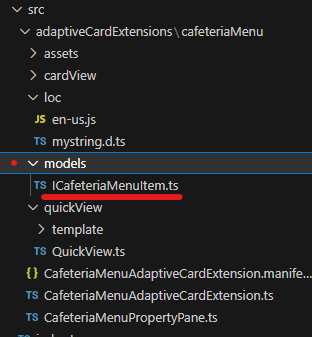
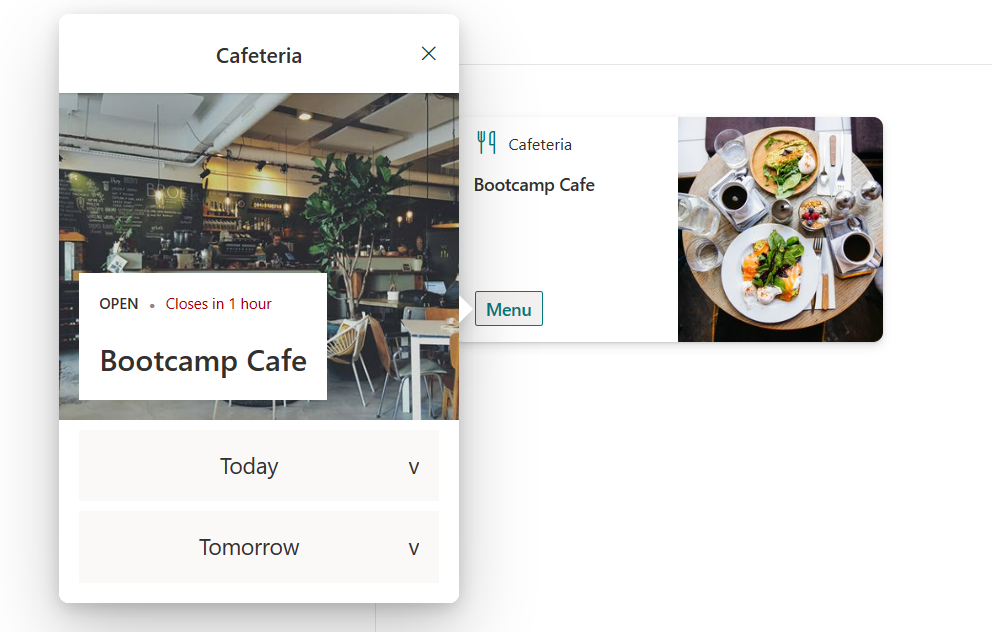
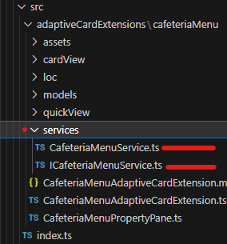

# Exercise 11 - Optimising the ACE
In this exercise we won't be adding any new functionality to the ACE. We will be making some updates to code base to bring in some software development best practices. The items outlines in this lab are not required but they do help from a maintainability, supportability and reuse perspective.

We will be following on from the cafeteria ACE solution we prepared in the previous Lab Sessions. 

## Task 1 - Create a dedicated Models folder

It's common practice to keep all models for the solution in a dedicated folder. This is commonly used to organise data models or classes that represent the structure and behavior of objects within an application. 

It is a way to separate the data-related code from other components of the ACE, making it easier to manage and maintain.

1. Create a folder in the ACE folder called `models`

`src\adaptiveCardExtensions\cafeteriaMenu\models`

2. Within this folder create a file called `ICafeteriaMenuItem.ts`

This should look like the following:



3. In this new file we need to move the `ICafeteriaMenuItem` interface from the `CafeteriaMenuAdaptiveCardExtension.ts` file to this new file. The `ICafeteriaMenuItem.ts` file should look like the below:

```typescript
export interface ICafeteriaMenuItem {
    day: string;
    title: string;
    description: string;
    imageUrl: string;
}
```

4. Final step is to now add an import in the `CafeteriaMenuAdaptiveCardExtension.ts` file. We had no import previously as the `ICafeteriaMenuItem` interface was in the file.

```typescript
import { ICafeteriaMenuItem } from './models/ICafeteriaMenuItem';
```

5. Save your changes and check your workbench. We should now see the ACE and the QuickView should be populated with data. No change to before but the model is simply being used from a different file.



## Task 2 - Create a dedicated Services folder

Having a "services" folder can help improve the organisation of your codebase, as it separates different aspects of your application's functionality into distinct modules. This separation of concerns makes it easier to maintain and extend the code in the future. It also encourages a more modular design, promoting code reuse and testability.

1. Create a folder in the ACE folder called `services`

`src\adaptiveCardExtensions\cafeteriaMenu\services`

2. Within this folder create a file called `ICafeteriaMenuService.ts` and another called `CafeteriaMenuService.ts`

This should look like the following:



3. Let's first focus on the `ICafeteriaMenuService.ts` interface. An interface is like a blueprint or a template that specifies what methods a class must have, but it does not dictate how those methods should be implemented. It only defines the method signatures, return types, and input parameters.

This interface will contain the definition for one method `getMenuItems`. Notice the import from our models folder as the return type of our method is an array of `ICafeteriaMenuItem` objects

```typescript
import { ICafeteriaMenuItem } from "../models/ICafeteriaMenuItem";

export interface ICafeteriaMenuService {  
    getMenuItems(siteUrl: string, listTitle: string): Promise<ICafeteriaMenuItem[]>;
}
```

4. Now let's look at the `CafeteriaMenuService.ts` file. The `CafeteriaMenuService` class implements our `ICafeteriaMenuService` interface. When a class implements an interface, it means that the class agrees to abide by the contract specified by the interface. This contract includes providing concrete implementations for all the methods declared in the interface.

In our case we have one methods in our interface so one method to implement. We also need a `constructor`. This will be called when we consume our service. This is where the `SPHttPClient` native/inbuilt service is consumed.  

```typescript
import { ServiceKey, ServiceScope } from "@microsoft/sp-core-library";
import { ICafeteriaMenuItem } from "../models/ICafeteriaMenuItem";
import { ICafeteriaMenuService } from "./ICafeteriaMenuService";
import { SPHttpClient } from '@microsoft/sp-http'

export class CafeteriaMenuService implements ICafeteriaMenuService {

    public static readonly serviceKey: ServiceKey<ICafeteriaMenuService> = 
        ServiceKey.create<ICafeteriaMenuService>('AceBootcamp.CafeteriaMenuService', CafeteriaMenuService);

    private _client: SPHttpClient;    

    constructor(serviceScope: ServiceScope) { 
        serviceScope.whenFinished(() => {
            this._client = serviceScope.consume(SPHttpClient.serviceKey);
        });
    }

    getMenuItems(siteUrl: string, listTitle: string): Promise<ICafeteriaMenuItem[]> {
        throw new Error("Method not implemented.");
    }
}
```

5. Now to the `getMenuItems()` method. We need to move the functionality from the `_fetchData()` method into this. We have added an initial check to ensure the service has been initialized before it attempts to connect to SPO. We are also using the `_client` property of the service that get's populated in the `constructor`. Final difference is that we are returning the items rather than setting the state.

```typescript
public getMenuItems(siteUrl: string, listTitle: string): Promise<ICafeteriaMenuItem[]> {
    // Check if the CafeteriaMenuService has been initialized.
    if (this._client === undefined){
        throw new Error('CafeteriaMenuService not initialized!')
    }

    // Step 1: Use the SharePoint HTTP client to send a GET request to retrieve data from the specified SharePoint list.
    // The URL for the request is built using the SharePoint API with the list title from the properties.
    return this._client.get(
        `${siteUrl}` +
        `/_api/web/lists/getByTitle('${listTitle}')/items`,
        SPHttpClient.configurations.v1,
        { headers: { 'accept': 'application/json;odata.metadata=none' }}
    )
    // Step 2: After getting a response from the server, convert it to JSON format.
    .then((response) => response.json())
    // Step 3: Map the JSON response to a new array of objects representing the menu items.
    .then((jsonResponse) => jsonResponse.value.map(
    (item: any) => 
    { 
        // Step 4: Extract specific properties (Title, Description, Day, ImageUrl) from each item in the JSON response.
        // Return a new object for each item with the extracted properties.
        return { 
        title: item.Title, 
        description: item.Description,
        day: item.Day,
        imageUrl: item.ImageUrl 
        }; 
    }))
}
```

## Task 3 - Implementing the interface.

1. We will need to add the relevant import to the `CafeteriaMenuAdaptiveCardExtension.ts` file

```typescript
import { ICafeteriaMenuService } from "./ICafeteriaMenuService";
```

2. We need to Initialize the `CafeteriaMenuService` Service. The best place for this is in the `OnInit()` method of the ACE. We store a reference to the service in the `_client` property.

```typescript
private _deferredPropertyPane: CafeteriaMenuPropertyPane;
private _client: ICafeteriaMenuService;

public onInit(): Promise<void> {
    this.state = {
        menuItems: []
    };

    // consume the service
    this._client = this.context.serviceScope.consume(CafeteriaMenuService.serviceKey);

    ...
}
```


3. Update the `_fetchData()` method as follows:

```typescript
private _fetchData(): Promise<void> {
    return this._client.getMenuItems(this.context.pageContext.site.absoluteUrl, this.properties.listTitle)
    // Step 5: After mapping the JSON response to menu items, update the component's state with the retrieved menu items.
    .then((items) => this.setState(
    { 
        menuItems: items 
    }));
}
```

A much cleaner method, without any SharePoint specific code. This data could now be coming from any data source.

4. Save all your changes and check your workbench. We should now see the ACE, it should look no different to before but the `SPO` list data is now being obtained and processed from the service.

