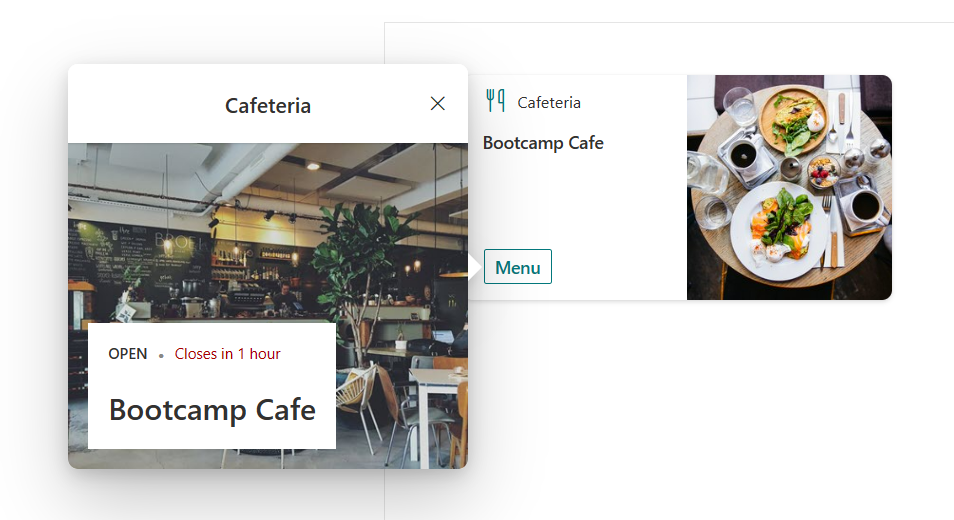
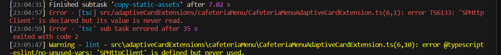

# Exercise 9 - Prepare ACE for Data
In this exercise we will prepare the solution to ingest data from a SharePoint List.

We will be following on from the cafeteria ACE created in the pervious Lab Sessions. 

## Task 1 - Add import for http client

We need to add an import to make the `SPHttpClient` available to consume. The `SPHttpClient`, makes it easy to work with SPO Rest APIs as it handles elements such as authentication tokens.

1. Open the file

`src\adaptiveCardExtensions\cafeteriaMenu\CafeteriaMenuAdaptiveCardExtension.ts`

2. Add the following import at the top of the file

```typescript
import { SPHttpClient } from '@microsoft/sp-http'
```

## Task 2 - Create an Interface to hold the Cafeteria Menu

1. Add the following code to the same file. Keep this interface definition near the top, with the other interface defintions.

```typescript
export interface ICafeteriaMenuItem {
    day: string;
    title: string;
    description: string;
    imageUrl: string;
}
```

## Task 3 - Update the ACE state.

1. Update the state interface to include a `menuItems` property

```typescript
export interface ICafeteriaMenuAdaptiveCardExtensionState {
  menuItems: ICafeteriaMenuItem[];
}
```

2. Initialise the `menuItems` state property as an empty array. This will enable our solution to compile and work without any data. Great for testing

```typescript
public onInit(): Promise<void> {
    this.state = {
        menuItems: []
    };
    ...
}
```

## Task 4 - Use State properties in the QuickView

Now we have the building blocks in place we can add code to our QuickView to display meal data from the state property in the QuickView.

1. Open the `QuickView.ts` file

`src\adaptiveCardExtensions\cafeteriaMenu\quickView\QuickView.ts`

2. We now want to update the `data()` method to return data from the `menuItems` state property rather than the JSON object we added in a previous lab. See below example of the return object for the `data()` method.

```typescript
return {
    menus: this.state.menuItems,
    restaurant_name: dataJson.restaurant_name,
    restaurant_state: dataJson.restaurant_state,
    time_to_close: dataJson.time_to_close
};
```

3. Save you changes and check your workbench. We should now see the ACE but the QuickView should be empty. As below:



> **Note**
>
> This preparation will be the same if we were ingesting data from another source, MSGraph or third party API.

You may encounter a compiler error as we are not using the `SPHttpClient` import. Simply comments out the import for now



```typescript
//import { SPHttpClient } from '@microsoft/sp-http'
```

