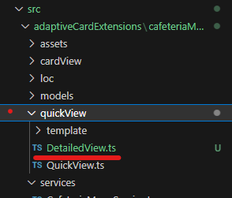
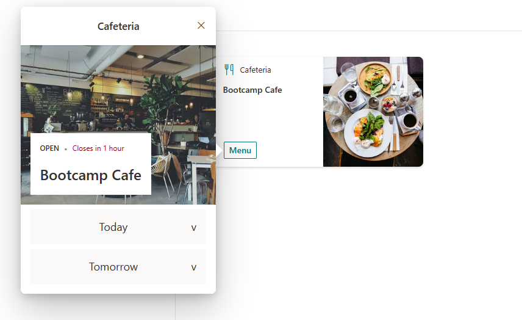
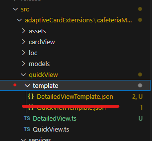
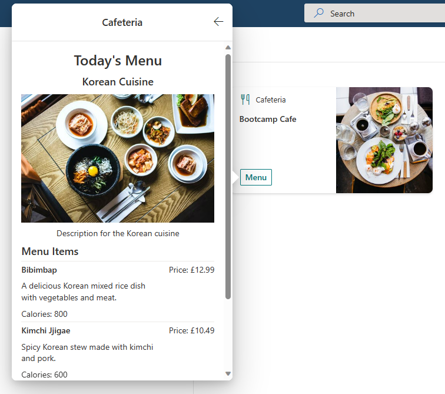

# Exercise 13 - Multiple QuickViews

In this exercise we will be adding functionality to the ACE to show a detailed view. A user can click on the days menu and see the food that is available in that menu.

In the last exercise we made some changes to our ACE to support a new data model. In this Lab we will add code for the additional QuickView.

# Task 1 - Create the new QuickView.ts

1. Add a new file in the `quickView` folder called `DetailedView.ts`



2. Add the following typescript to the new file. We are defining an interface with a menu property of type `ICaferteriaMenu`. If you remember, this object will contains the meals for a particular menu. Our first quickview displays the menus, the second will now show the details of that menu.

```typescript
import { ISPFxAdaptiveCard, BaseAdaptiveCardView } from '@microsoft/sp-adaptive-card-extension-base';
import { ICafeteriaMenuAdaptiveCardExtensionProps, ICafeteriaMenuAdaptiveCardExtensionState } from '../CafeteriaMenuAdaptiveCardExtension';
import { ICafeteriaMenu } from '../models/ICafeteriaMenu';

export interface IDetailedViewData {
  menu: ICafeteriaMenu
}

export class DetailedView extends BaseAdaptiveCardView<
  ICafeteriaMenuAdaptiveCardExtensionProps,
  ICafeteriaMenuAdaptiveCardExtensionState,
  IDetailedViewData
> {
  public get data(): IDetailedViewData {
    return {
        menu: this.state.selectedMenu
    }
  }

  public get template(): ISPFxAdaptiveCard {
    return require('./template/DetailedViewTemplate.json');
  }
}
```
You may have noticed we have added a reference to a state property called `selectedMenu`. This doesn't exist yet, vscode is likely giving you an error.

3. Let's fix that error and update our state definition

```typescript
export interface ICafeteriaMenuAdaptiveCardExtensionState {
  menus: ICafeteriaMenu[];
  selectedMenu: ICafeteriaMenu;
}
```

We also need to intilise this new state property as follows:

```typescript
  public onInit(): Promise<void> {
    this.state = {
      menus: [],
      selectedMenu: {} as ICafeteriaMenu
    };
    ...
  }
```

4. We need to register this new QuickView with the navigator. This involves defining an Id for the quickView

```typescript
export const QUICK_VIEW_REGISTRY_ID: string = 'CafeteriaMenu_QUICK_VIEW';
export const DETAILED_VIEW_REGISTRY_ID: string = 'CafeteriaMenu_DETAILED_VIEW';
```

5. Registering it with `quickViewNavigator` within the `onInit()` method

```typescript
    ...

    this.cardNavigator.register(CARD_VIEW_REGISTRY_ID, () => new CardView());
    this.quickViewNavigator.register(QUICK_VIEW_REGISTRY_ID, () => new QuickView());
    this.quickViewNavigator.register(DETAILED_VIEW_REGISTRY_ID, () => new DetailedView());

    return this._fetchData();
  }
```

6. You will also need to import the `DetailedView`

```typescript
import { DetailedView } from './quickView/DetailedView';
```

7. Finally save everything and check your workbench. Nothing should have changed as we still have not added the Adaptive Card template.



## Task 2 - Add the adaptive card

In an earlier lab you covered how to build adaptive cards. Feel free to build your own detailed view using the knowledge and skills gained in this lab. Or you download and use one that we have created [here](../Session6/Starter/src/adaptiveCardExtensions/cafeteriaMenu/quickView/template/DetailedViewTemplate.json)

1. Create a new file called `DetailedViewTemplate.json` in the `template` folder



2. Add the json for your adaptive card to this file. 

3. Save everything and check your workbench. Nothing should have changed as we still have not added the code to open this new adaptive card


## Task 3 - Update the QuickView to handle onClick events

We need to add some additional declaration in our `QuickViewTemplate.json`. The below adds an `Execute` action to the menu item once expanded.

1. Either add the below into your existing `QuickViewTemplate.json` or take a copy of it from [here](../Session6/Starter/src/adaptiveCardExtensions/cafeteriaMenu/quickView/template/QuickViewTemplate.json)

```json
{
    "type": "ColumnSet",
    "columns": [
        ...
    ],
    "id": "columnSet${day}",
    "isVisible": false,
     "selectAction": {
        "type": "Action.Submit",
        "data": {
            "id": "menuSelected",
            "selectedDay": "${day}"
        }
    }
}
```

2. Now that our Adaptive Card has a submit action we need to handle this in our typescript file. Open `QuickView.ts` and add the following `onAction` method.

```typescript
public async onAction(action: IActionArguments): Promise<void> {
    if ((<ISubmitActionArguments>action).type === 'Submit') {
        const submitAction = <ISubmitActionArguments>action;
        const { id, selectedDay } = submitAction.data;
        if (id === 'menuSelected') {
          const selectedMenu = this.state.menus.filter((item) => item.day === selectedDay)[0];
          this.setState({ selectedMenu: selectedMenu });
          this.quickViewNavigator.push(DETAILED_VIEW_REGISTRY_ID);
        }
    }
}
```

3. Last step is to add the import for the `DETAILED_VIEW_REGISTRY_ID` to the existing imports

```typescript
import { DETAILED_VIEW_REGISTRY_ID, ICafeteriaMenuAdaptiveCardExtensionProps, ICafeteriaMenuAdaptiveCardExtensionState } from '../CafeteriaMenuAdaptiveCardExtension';
```

4. Save everything and check your workbench. You should now have a detailed menu view!

