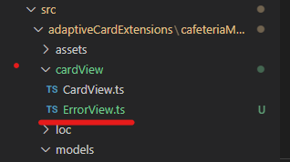
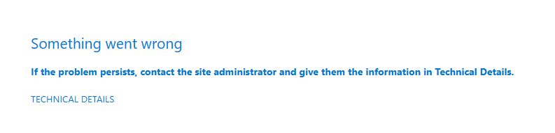
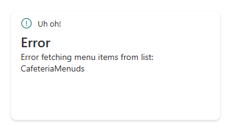

# Exercise 14 - Multiple CardViews

In this exercise we will be adding functionality to the ACE to show an error view. This will be shown if there is an issue with accessing the SPO List

This error view will provide a better user experience for dashboard owner when they are configuring the card.

# Task 1 - Create the new QuickView.ts

1. Add a new file in the `cardView` folder called `ErrorView.ts`



2. Add the following typescript to the new file. Our Error Card view will not have any buttons or on select actions. Just show the user that there is an error

```typescript
import {
    BasePrimaryTextCardView,
    IPrimaryTextCardParameters
  } from '@microsoft/sp-adaptive-card-extension-base';
  import { ICafeteriaMenuAdaptiveCardExtensionProps, ICafeteriaMenuAdaptiveCardExtensionState } from '../CafeteriaMenuAdaptiveCardExtension';
  
  export class ErrorView extends BasePrimaryTextCardView<ICafeteriaMenuAdaptiveCardExtensionProps, ICafeteriaMenuAdaptiveCardExtensionState> {
  
    public get data(): IPrimaryTextCardParameters {
      return {
        title: "Uh oh!",
        primaryText: "Error",
        description: this.state.errorMessage,
        iconProperty: "Error"
      };
    }
  }
```
You may have noticed we have added a reference to a state property called `errorMessage`. This doesn't exist yet, vscode is likely giving you an error.

3. Let's fix that error and update our state definition

```typescript
export interface ICafeteriaMenuAdaptiveCardExtensionState {
  menus: ICafeteriaMenu[];
  selectedMenu: ICafeteriaMenu;
  error: boolean
  errorMessage: string;
}
```

We have added two new state properties `error` and `errorMessage`. We need to initialize these two new state property as follows:

```typescript
  public onInit(): Promise<void> {
    this.state = {
      menus: [],
      selectedMenu: {} as ICafeteriaMenu,
      error: false,
      errorMessage: ''
    };
    ...
  }
```

4. We need to register this new ErrorView with the navigator. This involves defining an Id for the quickView

```typescript
this.cardNavigator.register(ERROR_VIEW_REGISTRY_ID, () => new ErrorView());
    this.cardNavigator.register(CARD_VIEW_REGISTRY_ID, () => new CardView());
```

5. Registering it with `cardViewNavigator` within the `onInit()` method

```typescript
    ...

    this.cardNavigator.register(ERROR_VIEW_REGISTRY_ID, () => new ErrorView());
    this.cardNavigator.register(CARD_VIEW_REGISTRY_ID, () => new CardView());
    this.quickViewNavigator.register(QUICK_VIEW_REGISTRY_ID, () => new QuickView());
    this.quickViewNavigator.register(DETAILED_VIEW_REGISTRY_ID, () => new DetailedView());

    return this._fetchData();
  }
```

6. You will also need to import the `ErrorView`

```typescript
import { ErrorView } from './cardView/ErrorView';
```

7. Now update the `renderCard()` function to return the Error view if the state property `error` is true

```typescript
protected renderCard(): string | undefined {
    if (this.state.error) {
      return ERROR_VIEW_REGISTRY_ID;
    }
    return CARD_VIEW_REGISTRY_ID;
  }
```

8. Now we need to simulate an error. Update the default value of the listTitle property to be incorrect. We want our `getMenuItems` method to fail when it attempts to get data from SPO. 

9. Finally save everything and check your workbench. You should see the SharePoint error as we have not added the code to catch the error populate the error state properties.



## Task 2 - Handle the Error

We need to add a try catch around of `_fetchData()` method. This will ensure that if the method fails at any point our code will catch this error and we can handle it. Rather than not catching the error and SharePoint catching the error for us. We want our Error card to render instead.

1. Update the `_fetchData()` method as follows. We surround the `getMenuItems` function with a try block to ensure that any error that it encounters will be caught in the catch block. The catch block simply sets the error state properties. We add a finally block to ensure that our method will return a a promise in all cases.

```typescript
private _fetchData(): Promise<void> {
    return this._client.getMenuItems(this.context.pageContext.site.absoluteUrl, this.properties.listTitle)
      .then((items) => this.setState(
        {
          menuItems: items
        }))
      .catch((error) => {
        this.setState({
          error: true,
          errorMessage: `Error fetching menu items from list: ${this.properties.listTitle}`
        });
      }
      )
  }
```

2. There is nothing else for us to do. The state update will casuse SPFx to rerender the cardView and the `renderCard()` method will now return the error card as `error` is true. Save everything and check your workbench. You should now have a Error card view!

