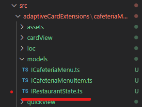

# Exercise 15 - Third Party data

In this exercise we will be adding functionality to the ACE to pull data from a third party data source using the various client libraries.

We will use this method to populate the opening times of our bootcamp cafe with real data.

# Task 1 - Update our ICafeteriaMenuService service definition

1. Add a new method called in the `getHoursUntilClose()` in our `ICafeteriaMenuService.ts`

```typescript
import { ICafeteriaMenu } from "../models/ICafeteriaMenu";
import { IRestaurantState } from "../models/IRestaurantState";

export interface ICafeteriaMenuService {  
    getMenuItems(siteUrl: string, listTitle: string): Promise<ICafeteriaMenu[]>;
    getHoursUntilClose(): Promise<IRestaurantState>;
}
```

2. We have a new model, `IRestaurantState`. We need to create a new file called `IRestaurantState.ts` in the models folders.



3. Add the following typescript to the model

```typescript
export interface IRestaurantState {
    state: string;
    hours: Number;
}
```

4. As we have updated the interface we now need to update the `CafeteriaMenuService` class that implements this interface. This is just a placeholder - We will update this method in a later step.

```typescript
    getHoursUntilClose(): Promise<IRestaurantState> {
        if (this._resturantAPI === undefined){
            throw new Error('CafeteriaMenuService not initialized!')
        }
        throw new Error("Method not implemented.");
    }
```

5. We are referencing a class variable called  `_resturantAPI`. This is a reference to the inbuilt `HttpClient` service that we will be using to call the anonymous API. We need to add a variable and consume the relevant service within our class constructor. The exact same process as when we were working with SPO data.

```typescript
    private _client: SPHttpClient;
    private _resturantAPI: HttpClient    

    constructor(serviceScope: ServiceScope) { 
        serviceScope.whenFinished(() => {
            this._client = serviceScope.consume(SPHttpClient.serviceKey);
            this._resturantAPI = serviceScope.consume(HttpClient.serviceKey);
        });
    }
```

6. We are working with an anonymous API sot he HTTP client is suitable, if this was an enterprise API then we would need to use the `AadHttpClient` that we covered in the slides. Update the `getHoursUntilClose()` method as below.

This URL is to an API hosted by me

```typescript
public getHoursUntilClose(): Promise<IRestaurantState> {
        if (this._resturantAPI === undefined){
            throw new Error('CafeteriaMenuService not initialized!')
        }

        return this._resturantAPI.get(
            `https://bootcampcafeag.azurewebsites.net/api/GetHoursUntilClose`,
            HttpClient.configurations.v1
        )
        .then((response: any) => response.json())
        .then((jsonResponse: IRestaurantState) => 
        {
            return {
                state: jsonResponse.state,
                hours: jsonResponse.hours
            }
        });
    }
```

7. Save all the changes and check your workbench. Nothing should change as we are yet to call this new method.

## Task 2 - Update the ACE base class

1. Firstly we need to add an additional state property for `restaurantState`

```typescript
// Add the import
import { IRestaurantState } from './models/IRestaurantState';

export interface ICafeteriaMenuAdaptiveCardExtensionState {
  menuItems: ICafeteriaMenu[];
  selectedMenuItem: ICafeteriaMenu;
  error: boolean
  errorMessage: string
  // new 
  restaurantState: IRestaurantState
}
```

2. As we now know, this new state property must be initialized int he `onInit()`

```typescript
public onInit(): Promise<void> {
    this.state = {
      menuItems: [],
      selectedMenuItem: {} as ICafeteriaMenu,
      error: false,
      errorMessage: '',
      restaurantState: { state: "CLOSED" } as IRestaurantState
    };
    //..
```

We want our resturant to have an initial state of CLOSED. So we set that here

Now we have some new state values we can update out QuickView to use this data.

## Task 3 - Update QuickView to use State property

1. Open the QuickView.ts file

`src\adaptiveCardExtensions\cafeteriaMenu\quickView\QuickView.ts`

2. Update the data getter as below:

```typescript
import * as strings from 'CafeteriaMenuAdaptiveCardExtensionStrings';
//..

public get data(): IQuickViewData {

    let hoursToClose = "0"
    if (this.state.restaurantState.state === 'CLOSED') {
      hoursToClose = "N/A";
    }
    else {
      hoursToClose = `${this.state.restaurantState.hours.toString()} hours`;
    }

    return {
      menus: this.state.menuItems,
      restaurant_name: strings.PrimaryText,
      restaurant_state: this.state.restaurantState.state,
      time_to_close: hoursToClose
    };
  }
```

We have been able to remove the string json data and populate all the data from either state or strings. You may need to import strings. We are performing some check on our data to ensure we populate the `time_to_close` field with the correct data.

3. Save everything and check your workbench. You should see the following. Restaurant is closed


## Task 4 - Call the API

Now that we have everything else configured we need to call the API and populate our state data

1. Update our fetchData method. We could write another function but keeping these two calls in the same function works well. We have removed our return from the initial `getMenuItems()` call. This means that our function will execute this and move onto the next. So it will call out `getHoursUntilClose()` directly after the first `getMenuItems()` call. We can do this as out API calls are not dependent on each other. Our functional now returns the `Promise.resolve()` directly. It will do this after making the two API calls. Once the promise is resolved our card view will be shown. We can rely on our state updates to refresh the views once the API calls have returned a response and in turn updated the state values.

```typescript
private _fetchData(): Promise<void> {
    
    // Fetch Menu Items
    this._client.getMenuItems(this.context.pageContext.site.absoluteUrl, this.properties.listTitle)
      .then((items) => this.setState(
        {
          menuItems: items
        }))
      .catch((error) => {
        this.setState({
          error: true,
          errorMessage: `Error fetching menu items from list: ${this.properties.listTitle}`
        });
      }
    )

    // Fetch Restaurant State
    this._client.getHoursUntilClose()
      .then((state) => this.setState(
        {
          restaurantState: state
        }))
      .catch((error) => {
        this.setState({
          error: true,
          errorMessage: `Error fetching restaurant state from API`
        });
      }
    )
  
    return Promise.resolve();
  }
```

2. Save everything and check your workbench. You should see the following. Restaurant is open (well it closes at 5PM GMT everyday)

